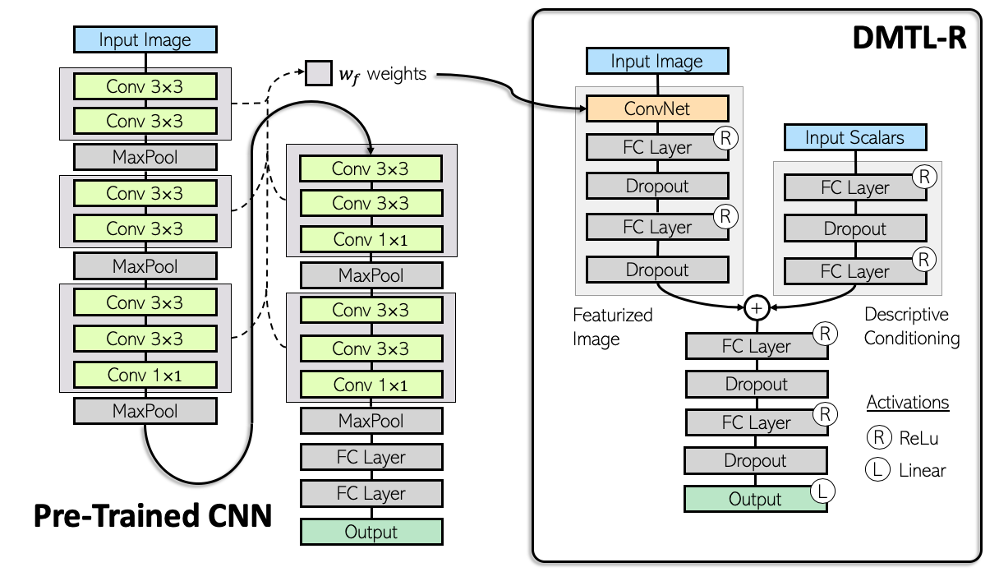
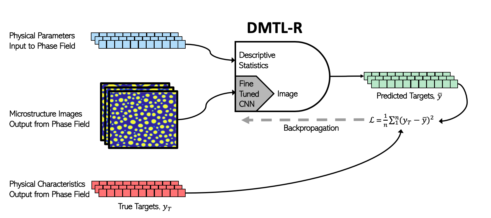

## DMTL-R - Official Implementation


### Deep Multimodal Transfer-Learned Regression in Data-Poor Domains
#### Levi McClenny<sup>1, 2</sup>, Mulugeta Haile<sup>2</sup>, Brian Sadler<sup>2</sup>, Ulisses Braga-Neto<sup>1</sup>, Vahid Attari<sup>3</sup>, Raymundo Arroyave<sup>3</sup>

Abstract: *In many real-world applications of deep learning, estimation of a target may rely on various types of input data modes, such as audio-video, image-text, etc. This task can be further complicated by a lack of sufficient data. Here we propose a Deep Multimodal Transfer-Learned Regressor (DMTL-R) for multimodal learning of image and feature data in a deep regression architecture effective at predicting target parameters in data-poor domains. Our model is capable of fine-tuning a given set of pre-trained CNN weights on a small amount of training image data, while simultaneously conditioning on feature information from a complimentary data mode during network training, yielding more accurate single-target or multi-target regression than can be achieved using the images or the features alone. We present results using phase-field simulation microstructure images with an accompanying set of physical features, using pre-trained weights from various well-known CNN architectures, which demonstrate the efficacy of the proposed multimodal approach.*

<sub><sub><sup>1</sup>Texas A&M Dept. of Electrical Engineering, College Station, TX</sub></sub><br>
<sub><sub><sup>2</sup>US Army CCDC Army Research Lab, Aberdeen Proving Ground/Adelphi, MD</sub></sub><br>
<sub><sub><sup>3</sup>Texas A&M Dept. of Materials Science, College Station, TX</sub></sub>

### Estimator Architecture
<center>
  
</center>

Multimodal refers to the fact that multiple types of input are supported and compliment each other to yield more accurate regression. The estimator takes advantage of transfer-learned weights from well-known and widely available CNN architectures. The entire estimator is trained via forward passes and subsequent backpropagation, as opposed to individually trained estimators which are aggregated or otherwise selected after training. The training flow is diagrammed here:

<center>
  
</center>


## Requirements
Code was implemented on the following versions:
```
tensorflow version = 1.15.2
numpy version = 1.15.4
keras version = 2.2.4
```

We created a short script to test for the versions on your local machine, run the command
```
python versiontest.py
```
and verify versions. Tensorflow v2.2 is also know to work properly. Other versions of ```numpy``` and ```tf.keras``` should still function properly, but will likely throw depreciation warnings.

### Virtual Environment
**(Mac)** To create a virtual environment to run this code, download the repository either via ```git clone``` or by clicking download at the top of github, then navigate to the top-level folder in a terminal window and execute the commands

```
python3 -m venv --system-site-packages ./venv
source ./venv/bin/activate
```

This will create a virtual environment named ```venv``` in that directory (first line) and drop you into it (second line). At that point you can install/uninstall package versions without effecting your overall environment. You can verify you're in the virtual environment if you see ```(venv)``` at the beginning of your terminal line. At this point you can install the exact versions of the packages listed here with the pip into the venv:

```
pip install tensorflow==1.15.2 numpy==1.15.4 keras==2.2.4
```

run
```
python versiontest.py
```

And you should see the following output:
```
Using TensorFlow backend
tensorflow version = 1.15.2
keras version = 2.2.4
numpy version = 1.15.4
```

## Data
The data used in the paper is a subset of the data available at the [open-source microstructure database](http://microstructures.net). Data in the paper has been reduced to 2500 images of fully spinoidally-decomposed micorstructures, which have been preprocessed for each individual CNN. Those files are available as a ```.pkl``` file.

Data must be stores in the ```data/``` directory of this repo for the DMTL-R estimator to find it. The files are large (~1.5 Gb for the ResNet/VGG16 networks and ~2.4 Gb for the Inception network), therefore it is only recommended that you download the one that you are interested in running.


## Usage
Once the data is in the ```data/``` folder, then training DMTL-R can be done by running the command
```
python train.py --resnet
```

where the flag ```--resnet``` can be replaced with ```--inception``` or ```--VGG16``` if those models are desired. The DMTL-R results will automatically pop up in a quartz (or equivalent) window upon completion, similar to the one below:

<center>
  
</center>

## Citation
Cite using the Bibtex citation below:

```
@article{,
  title   = {Deep Multimodal Transfer-Learned Regression in Data-Poor Domains},
  author  = {},
  journal = {},
  volume  = {},
  year    = {2020},
}

```
